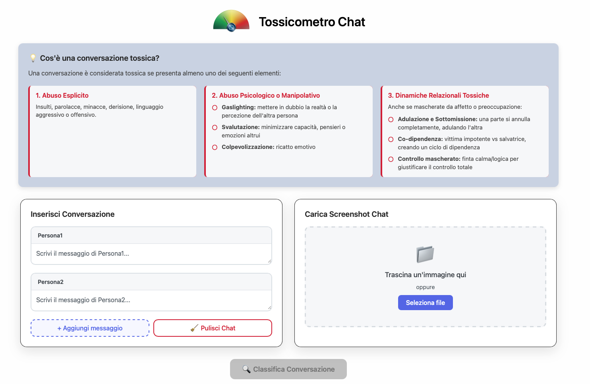

**Tossicometro: a LLM-based System for Real-Time Detection of Toxicity**

Tossicometro is a real-time, explainable LLM-based system designed to detect Cyber Intimate Partner Violence (CIPV) in digital conversations, accepting both direct text input and chat screenshots.

**Overview**



**Installation**

Before installing dependencies, we recommend creating a clean virtual environment using conda to avoid package conflicts:
```bash
conda create -n tossicometro python=3.10 -y
conda activate tossicometro
```

Now, install all the required Python packages:
```bash
git clone https://github.com/antonioiammarino/tossicometro_chat.git
cd tossicometro
pip install -r requirements.txt
```

**Usage**

Before you begin, ensure you have the following installed:
- Node.js and npm (for the frontend)
- A Google Cloud project with the Vertex AI API enabled.

To use Tossicometro, you need to run two separate terminal processes:
1. Terminal 1: Start the Backend 
```bash 
    python backend/backend_server.py
```
2. Terminal 2: Start the Frontend 
```bash
    cd frontend/tossicometro
    npm start
```

**Experiment Pipeline**

To replicate the tossicometro pipeline and experiments, follow the steps below.
1. Preprocessing: starting from the original dataset dataset/classification_and_explaination_toxic_conversation(in).csv, run the following scripts in order
    - preprocessing/clean_csv.py
    - preprocessing/repair_failures.py
    - preprocessing/normalize_conversation.py
2. Data Augmentation: create the balanced dataset of 1000 non-toxic conversations using the script datasets/create_dataset.py
    - Note: This script requires gpt-oss:20b and Ollama to be installed and running. Please follow the Ollama installation instructions on their website.
3. Training & Evaluation:
    - Detoxify: to get predictions from the pre-trained Detoxify multilingual model
        ```bash
            python detoxify_classifier.py
        ```

    - Traditional ML (TF-IDF + Logistic Regression): this is a two-step process. First, train the classifier on the balanced dataset
        ```bash
            python tf_idf_classifier.py
        ```
    
        Then, generate predictions using the trained model:
        ```bash
            python logge_predict.py
        ```
        
    - LLM (Gemini): to get predictions using prompt engineering with the Gemini model 
        ```bash
            python gemini_classifier.py
        ```
